# Statistics of My Diary

Visualize my diary entries like GitHub for commits. Here are two examples

### 2025
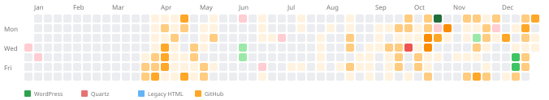
722 articles in 2025: 700 GitHub, 16 Quartz, 6 WordPress

### 2006
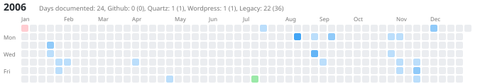

49 articles in 2006

## 7 categories

- diary
- blog
- legacy
- subdomains
- github
- github_websites
- google_sites

### 7 metrics

- Documents or projects: 143
- Individual pages: 315
- Days documented: 1132 of 18345 (6.17%)
- Total words: 1,432,423
- Total sentences: 3,154
- Total images: 132
- Required total reading time: 15 hours 4 minutes

The parsing could be embedded in some csv files that are updated each run:

| category        | label       | items | pages | days | words | sentences | images | reading_time |
|-----------------|-------------|------:|------:|-----:|------:|----------:|-------:|:------------:|
| diary           | Diary       |   142 |   142 |   30 | 66756 |       300 |    200 |     4h11     |
| blog            | Blog        |     0 |     0 |    0 |     0 |         0 |      0 |     0h00     |
| legacy          | Legacy      |     0 |     0 |    0 |     0 |         0 |      0 |     0h00     |
| subdomains      | Subdomain   |     0 |     0 |    0 |     0 |         0 |      0 |     0h00     |
| github          | Github      |     0 |     0 |    0 |     0 |         0 |      0 |     0h00     |
| github_websites | GH Website  |     0 |     0 |    0 |     0 |         0 |      0 |     0h00     |
| google_sites    | Google site |     0 |     0 |    0 |     0 |         0 |      0 |     0h00     |
| sum             | Sum         |   142 |   142 |   30 | 66756 |       300 |    200 |     4h11     |

## Visualisation

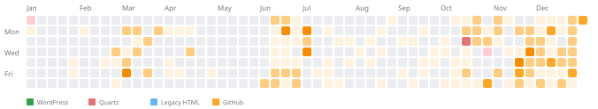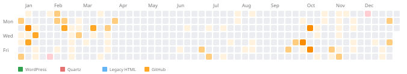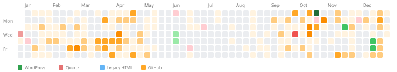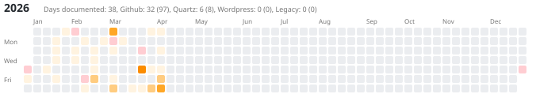
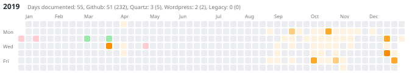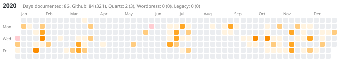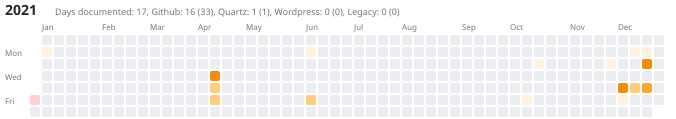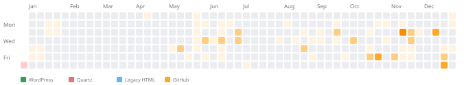
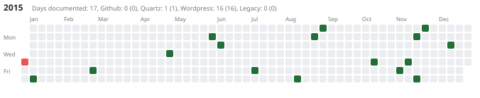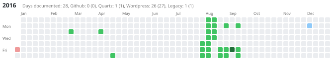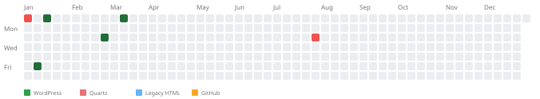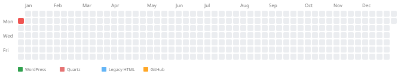
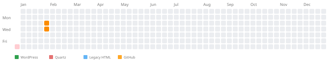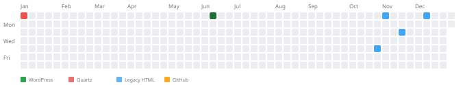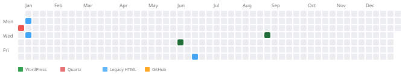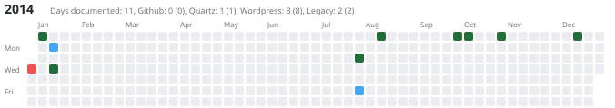
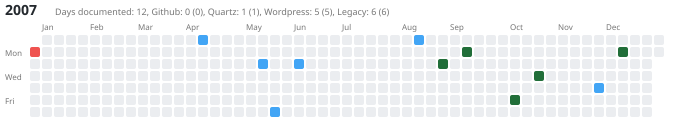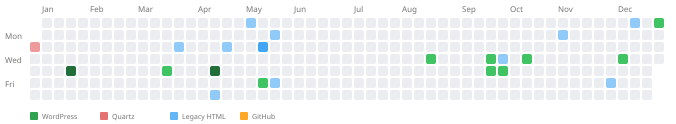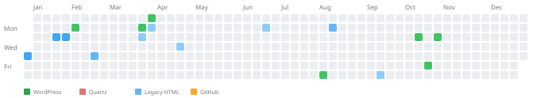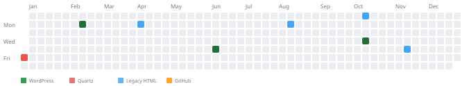
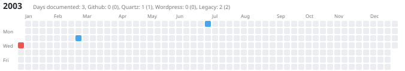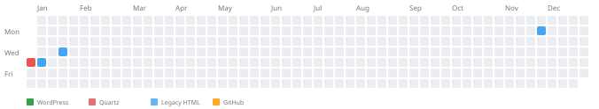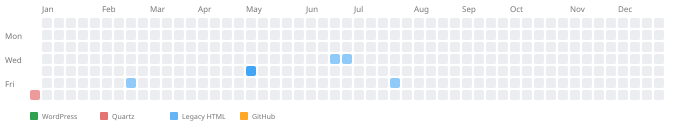
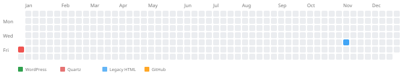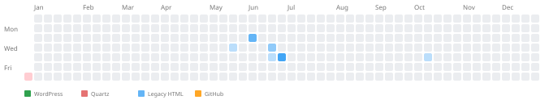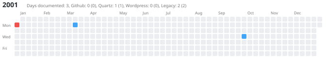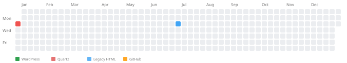
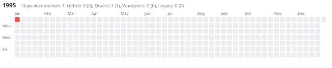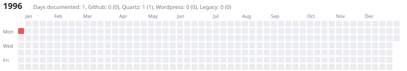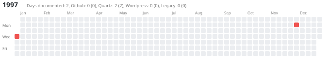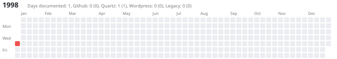
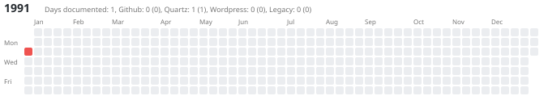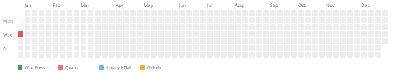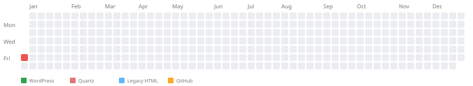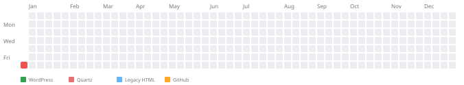
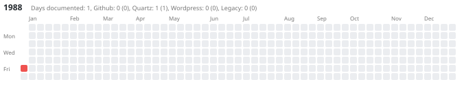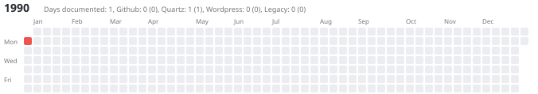
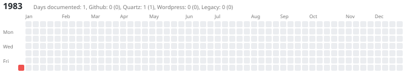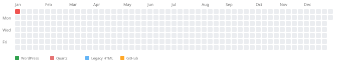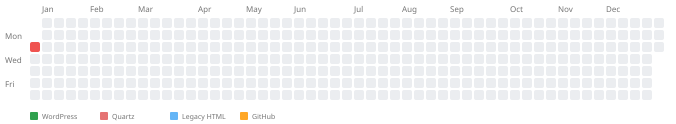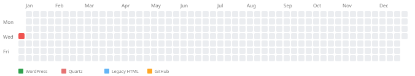
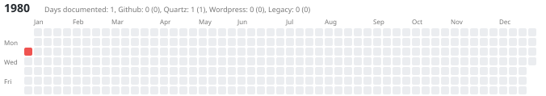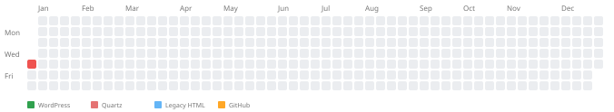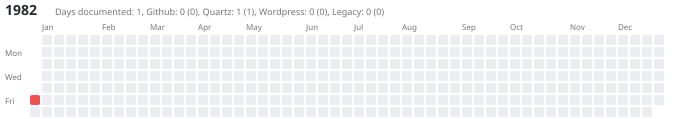
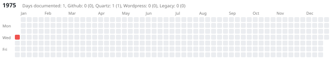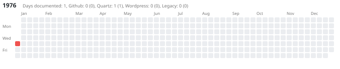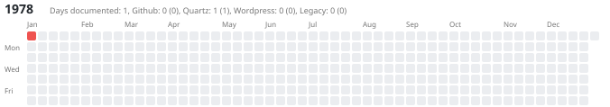

