# Statistics of My Diary

Visualize my diary entries like GitHub for commits.

<!-- START_STATS -->
# Diary Activity Overview

### 2026
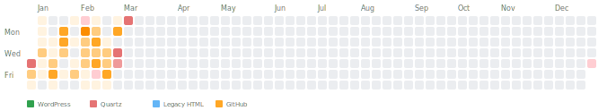

10 articles in 2026

### 2025
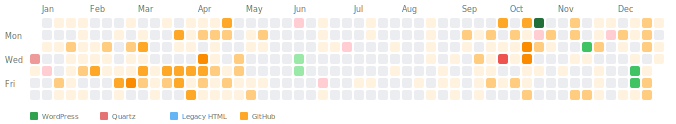

6 articles in 2025

### 2024
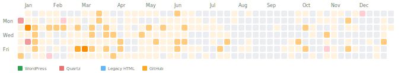

0 articles in 2024

### 2023
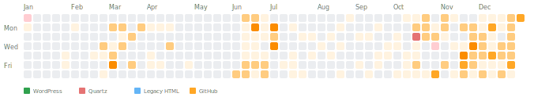

0 articles in 2023

### 2022
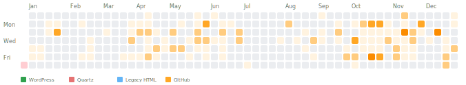

0 articles in 2022

### 2021
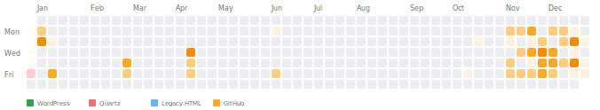

0 articles in 2021

### 2020
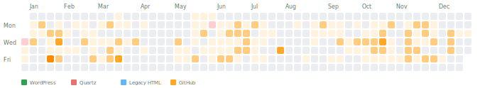

0 articles in 2020

### 2019
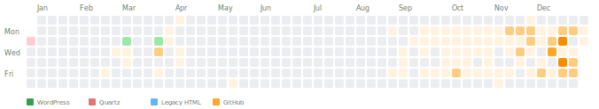

2 articles in 2019

### 2018
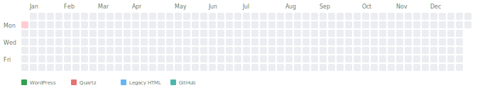

0 articles in 2018

### 2017
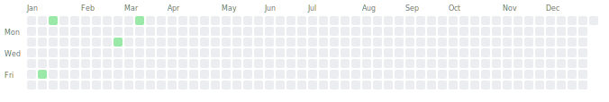

4 articles in 2017

### 2016

28 articles in 2016

### 2015
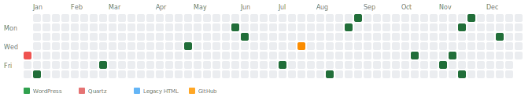

16 articles in 2015

### 2014
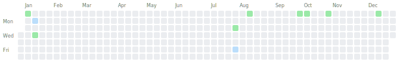

10 articles in 2014

### 2013
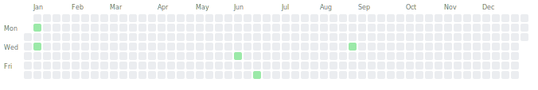

5 articles in 2013

### 2012
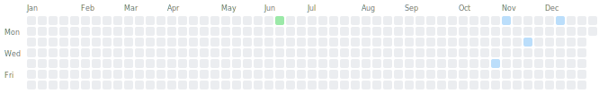

5 articles in 2012

### 2011

0 articles in 2011

### 2010
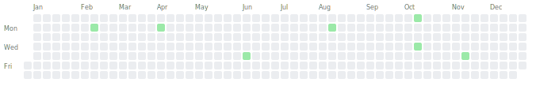

7 articles in 2010

### 2009
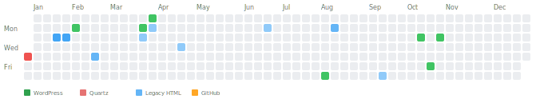

23 articles in 2009

### 2008
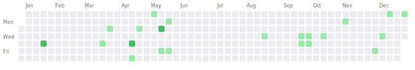

25 articles in 2008

### 2007
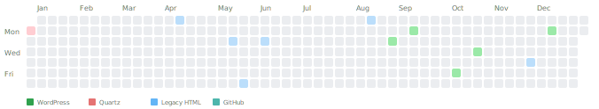

10 articles in 2007

### 2006

52 articles in 2006

### 2005
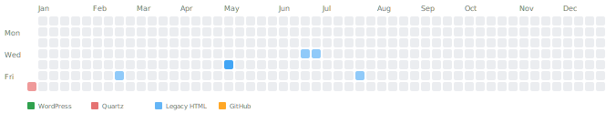

26 articles in 2005

### 2004
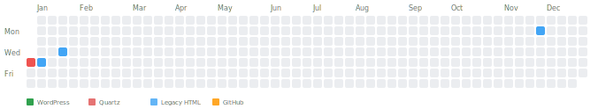

8 articles in 2004

### 2003
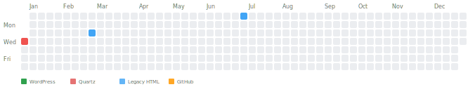

3 articles in 2003

### 2002
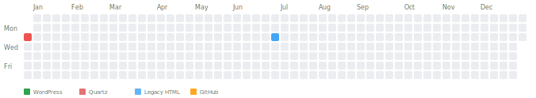

2 articles in 2002

### 2001
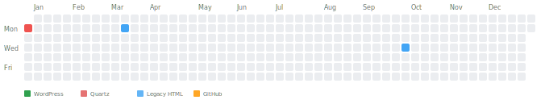

5 articles in 2001

### 2000
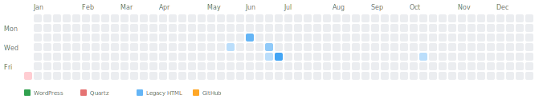

22 articles in 2000

### 1999
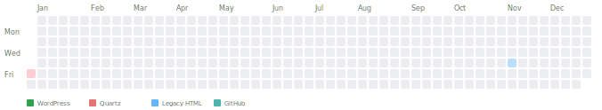

1 article in 1999

## Statistics
- **Days covered:** 200
- **Total articles:** 270
- **Total words:** 266388
- **Total reading time:** 22h 12m
<!-- END_STATS -->
