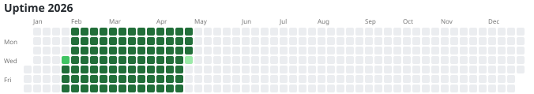
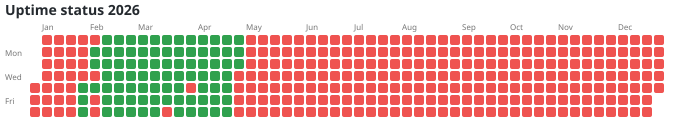

# Tuptime Heatmaps

This page shows the uptime of the computer based on the `tuptime` database.

## Running Time Intensity

This heatmap shows the daily running time. Darker green indicates more uptime during that day.

## Uptime Status

This heatmap highlights days without 100% uptime. Green indicates the computer was running for the full 24 hours. Red indicates any amount of downtime or partial uptime.

